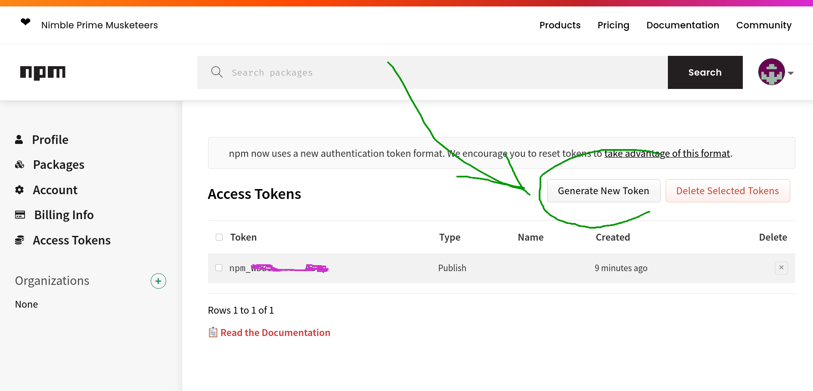

# CI Secrets Management

## `npm` releases to https://npmjs.org

* To publish the npm package to [npmjs.org](https://npmjs.org), we use an https://npmjs.org user :
  * we created that user with a username, a password, and an email address.
  * to generate the `npm` `~/.npmrc` credentials file, we interactively log in using the username and passord set during npmjs.org user account creation :

```bash
$ npm login
npm notice Log in on https://registry.npmjs.org/
Username: pokusio
Password:
Email: (this IS public) bumbebee.pokus.bot@gmail.com
npm notice Please check your email for a one-time password (OTP)
Enter one-time password: 30651495
Logged in as pokusio on https://registry.npmjs.org/.
$ npm whoami
pokusio
~$ ls -alh ~/.npmrc
-rw------- 1 jibl jibl 74 Jan 19 04:31 /home/jibl/.npmrc
$ cat ~/.npmrc
//registry.npmjs.org/:_authToken=npm_DEADBEAFDEADBEAFDEADBEAFDEADBEAF
```

* Then we stored that credential file into the secret manager (hashicorp vault / kubeseal ) :

```bash
ls -alh ~/.npmrc
```


To generate the access token required in the `~/.npmrc` file, we can use :

* the https://npmjs.org web ui :




```bash

```

<!--

### tooling

* To publish the npm package to npm, run :


```bash

```


* ccc :


-->
