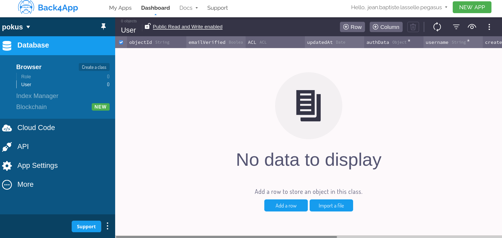

# What is this ?

This is a Yeoman generator, which spawns up an "augmented" [`hugo`](https://gohugo.io) project

## Features

The generated project contains the follwoning features, and options :

* serverless options :
 * [ ] for [Firebase](https://firebase.google.com/)  database for a service like a JavaScrpt Component... https://www.youtube.com/watch?v=-UOkri_WNWQ
 * [ ] at least 3/4 funstins mae available by firebase serverless :  https://www.youtube.com/watch?v=udHm7I_OvJs&list=PL4cUxeGkcC9i_aLkr62adUTJi53y7OjOf
* authentication options :
 * [ ] for [Firebase](https://firebase.google.com/) authentication for static websites, see https://www.youtube.com/watch?v=MZ54na2uXAA
 * [ ] any opensource alternative to [Firebase](https://firebase.google.com/) authentication for static websites, I want to be able to host same OpenID Connect  / OAuth2 authentication service on premise, to integrate my website with it.
 * [ ] github authentication with passportjs. (without server ? firebase is so much better there...)


AND ALSO EXTREMELY IMPORTANT USING SERVERLESS FIREBASE FUNCTIONS LIKE FIRESHIP.IO


* JavaScript Family Languages options:
  * [ ] `TypeScript`: all javascript is compiled from TypeScript, then embarqued. `TypeSript`/`RxJS`
  * [ ] `CoffesScript`: all javascript is compiled from TypeScript, then embarqued. `CoffeeSript`/`RxJS`
* tests :
  * [ ] `mochajs`
  * [ ] `jest`
  * [ ] `cypress`
  * linters :
    * [ ] `prettier`
    * [ ] `Dokcerfile`
    * [ ] `more ?`
  * load tests :
    * [ ] k6 tests
    * [ ] Gatling tests, with https://gettaurus.org https://www.saashub.com/compare-taurus-vs-cypress-io?ref=compare
  * SEO tests :
    * [ ] find tools to tests SEO performance, find improvements to bring fro SEO
* [ ] conventional commits git hooks tooling
* [ ] Dockerfile to run locally for tests
* `Circle CI`, `Drone CI`, `Tekton CI/CD`,  Pipelines to automate :
  * release (with deployment) :
    * [ ] to github pages, (default)
    * [ ] to heroku free offer (1.25 containers offered),
    * [ ] to [AWS Beanstalk](https://aws.amazon.com/elasticbeanstalk/) : between AWS S3 website and ECS, i'd prefer ECS (Fargate)
    * [ ] to [Back4App](https://www.back4app.com/) : this one very similar to heroku, this one is very important to proppose as alternative to Heroku j'ai créé mon compte avc une Github OAuth : https://parse-dashboard.back4app.com/apps/7b3bd8d3-4ccf-48b8-bd43-7e2314a5eb1b/browser
    * [ ] to [Google App Engine](https://cloud.google.com/appengine) : That's a PAAS, so same as heroku, but that's what they did at `Google`
    * [ ] to [Dokku](https://dokku.com/), same as Heroku, but seems much younger and done by community, and there is no dashboard, only a cli based, but gitops oriented too.
    * [ ] to [Firebase](https://firebase.google.com/) :
      * https://www.youtube.com/watch?v=GzG1hqej7UQ
      * https://www.youtube.com/watch?v=w7xKZ5PWizs
    * [ ] to gitlab pages,
    * [ ] to gitea pages : https://github.com/go-gitea/gitea/issues/302, while gitea is deployed to a VM or a K8S Cluster into a cloud provider
    * [ ] to AWS ECS (container),
    * [ ] to AWS ECS Fargate (containers without volumes),
    * [ ] to AWS Virtual machine,
    * [ ] to AWS S3 bucket turned into a website,
    * [ ] to AWS EKS Kubernetes cluster,
    * [ ] to Digital Ocean VM
    * [ ] to Azure with a VM
    * [ ] to Azure AKS Kubernetes Cluster
    * [ ] to GCP managed Kubernetes offer
    * [ ] to Alibaba lcoud with a VM / or a managed Kubernetes
  * tests and deployment on `develop` and Pull Requests branches :
    * [ ] for PR branches: to `${PR_BRANCH_NAME}.surge.sh`
    * for develop branches:
      * [ ] to `develop.surge.sh`, for design validation User Acceptance Tests
      * [ ] to a deployment target similar to production : oif prod is on AWS EKS, same. Purpose is to run perfomance tests
* all deployment capabilities come from :
  * [ ] a pokus Circle CI Orb,
  * [ ] a pokus Drone CI Module (Orb?),
  * [ ] a pokus Tekton CI Module (Orb?),
  * [ ] the only thing tht is in that repo are the confiig files `.circleci/config.yml`, `.drone.yml`, etc...
* [ ] [`CSSpurge`](https://github.com/FullHuman/purgecss)
* [ ] `scss`
* [ ] `sass`
* one css framework among :
  * [ ] `spectre`
  * [ ] `bulma`
  * [ ] `bootstap`
  * [ ] `Material` design for web : https://material.io/develop/web
  * [ ] `Material` deing for android : https://material.io/develop/android
  * [ ] `Material` deing for ios : https://material.io/develop/ios
  * [ ] `Material` design for [Flutter](https://flutter.dev/) framework : https://material.io/develop/flutter
  * [ ] http://getskeleton.com/
  * [ ] `Material` `MUI` Framework : https://www.muicss.com/
* [ ] All foolowing the git flow default configuration, in the end the git flow configuration can be customized (will change git branche names in the ci confiig files `.circleci/config.yml`, `.drone.yml`, etc...)
* [ ] Setup of tools to manage enofrcing semantic release, conventional commits, git based changelog generation, commit messages linters :
  * [ ] RELEASE NOTES generator
  * [ ] Changelog generator
  * [ ] commit messages linters to enforce format rules on commit messages
  * [ ] git hooks to enforce format rules on commit messages
  * [ ] git hooks to enforce conventional commit standards
  * Outils à tester requête de recherhe : https://www.npmjs.com/search?q=changelog&page=1&perPage=20
    * https://www.npmjs.com/package/conventional-changelog
    * https://www.npmjs.com/package/changelog-maker
    * https://www.npmjs.com/package/conventional-changelog-conventionalcommits
    * https://www.npmjs.com/package/commitizen
    * https://www.npmjs.com/package/cz-conventional-changelog
    * https://www.npmjs.com/package/conventional-commits-parser
    * https://www.npmjs.com/package/semantic-release
    * https://www.npmjs.com/package/@semantic-release/changelog
    * https://www.npmjs.com/package/@commitlint/lint
    * https://www.npmjs.com/package/changelog
    * https://www.npmjs.com/package/semantic-release-gitmoji
* hugo shortcodes :
  * [ ] Gallery/Carousel
  * [ ] tag clouds
  * [ ] social links to page/user : for all socials (50+)
  * [ ] discord chat with WidgetBot
  * [ ] my component for livestreaming
  * [ ] leaflet/OSM(OpenStreetMap) :
    * [ ] with option to change to custom layer, example for départemnt franaçais
  * [ ] component to insert team memers cards set : you just give all tea memebrs info, into a data/json file, and generate it all with pictures etc..
* to manage formating pictures, i will use :
  * the `Directus CMS` , to manage pictures files formats, see https://www.youtube.com/watch?v=f0nHtLJOBXs
  * minio to store assets ?
  * the `Directus CMS` REST API to automate tthose pictures formating operations?

See also https://github.com/pokusio/hugo-node-starter

# How to use

```bash
export YO_VERSION="4.3.0"
export YO_GEN_VERSION="0.0.0"
export YO_GEN_VERSION="feature/init-src"

export WHERE_TO_GENERATE_PROJ=$(mktemp -d -t "XXXXXXXX_GENERATED_POKUS_PROJ")


# Install
npm remove -g yo
npm install -g yo@${YO_VERSION}


```

* How to test the yeoman generator :

```bash

```

## ANNEX A: `Back4App` dashboard



<!--

* [ ] ccc :


```bash

```


* [ ] ccc :


```bash

```


* [ ] ccc :


-->
